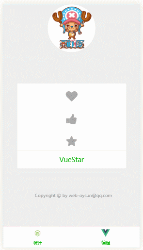

# VueStar




# 米娜撒，新年快乐！❤❤❤

# API

## Props

| 参数    | 类型    | 说明   |
| ------------- |-------------| -----|
| animate | String | 点赞激活时候的动画|
| color  | String | 点赞激活时候的颜色(注意填写的是hex或者rgb的颜色代码) |

## Slot

| SlotName    | 说明   |
| -------------| -----|
| icon  | 承载点赞的图标 |

# 详细说明

## Props

### animate
`animate`指明点赞图标动画,默认是没有动画的，你可以添加动画css类，当然，也可以引入第三方css动画库，比如animate.css


### color
`color`是当点赞组件激活时候点赞图标的颜色变化,默认是没有颜色变化的。注意：该参数填写的值必须是hex或者rgb颜色代码，而不是css类


## Slot

### icon
`icon`是点赞组件承载的核心,往该`slot`里面填入任意你需要的图标


### 关于event
#### 简单来说该组件其实就一个包裹内容的控件,围绕`slot`中的内容，当你`slot`中内容被激活（点击等等之类的事件）时候，做出相应的变化(颜色改变和css动画)，这是耦合组件的属性。但是其余对于`slot`被激活的时候产生的回调（点赞次数+1等等），应该与组件应该完全解耦。这类事件应该绑定在`slot`中

```vue
<template>
  <vue-star animate="animated rubberBand" color="#F05654">
    <a slot="icon" class="fa fa-heart" @click="handleClick"></a>
  </vue-star>
</template>

</script>
export default {
  methods: {
    handleClick () {
      //do something
    }
  }
}
</script>
```

## 简单的例子
```html
  <vue-star animate="yourAnimateCssClass" color="rgb(152, 138, 222)">
    
  </vue-star>
```

```html
  <!--动画引入animate.css库,icon引入font-awesome图标库  -->
  <vue-star animate="animated bounceIn" color="#F05654">
    <i slot="icon" class="fa fa-heart"></i>
  </vue-star>
```

# 安装和使用

```javascript
npm install vue-star
```

- 若作为全局组件使用

```javascript
//在项目入口文件
import Vue from 'vue'
import VueStar from 'vue-star'
Vue.component('VueStar', VueStar)
```

- 若作为局部组件

```javascript
//在某个组件中
import VueStar from 'vue-star'
export default {
  components: {
    VueStar
  }
}
```
# bug和建议

如果在使用中遇到问题或者建议，欢迎提`issues`

# LICENSE

MIT