# VueStar

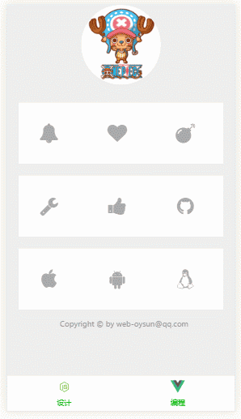

---------------------------------------------------------------------

## 查看中文文档，请移步至 [这里](https://github.com/OYsun/VueStar/blob/master/README-ZH.MD)

# demo
### For a better demonstration, please use the phone scan the following two-dimensional code view demo


# API

## Props

| Option     | Type    | Description   |
| ------------- |-------------| -----|
| animate | String | To activate the animation of the like button|
| color  | String | Activate the like button, the color of the button. (note to must be  hex or RGB color code) |

## Slot

| SlotName    | Description   |
| -------------| -----|
| icon  | Set up the like button |

# Detailed instructions

## Props

### animate
`animate`Specify the like button animation, the default is no animation, you can add animation CSS class, of course, can also introduce  CSS animation library, such as animate.css


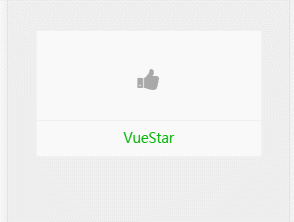
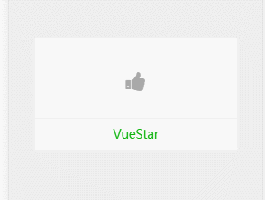
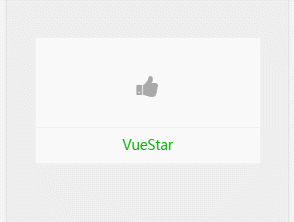
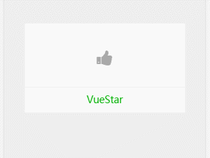

### color
`color`Activate the button when the button color changes, the default is not. Note: The value of this parameter must be filled in hex or rgb color code, rather than the css class

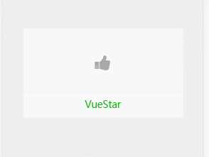
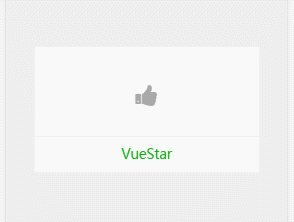
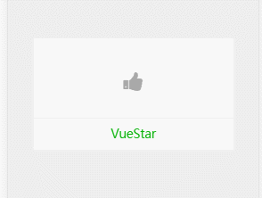


## Slot

### icon
`icon`To the ` slot ` inside fill in any content you want, it is the carrier of the like button

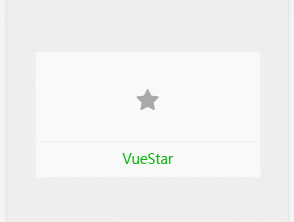
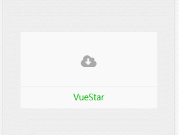
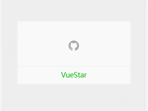

### abuout event
####  Events should be bound in the `slot`

```vue
<template>
  <vue-star animate="animated rubberBand" color="#F05654">
    <a slot="icon" class="fa fa-heart" @click="handleClick"></a>
  </vue-star>
</template>

</script>
export default {
  methods: {
    handleClick () {
      //do something
    }
  }
}
</script>
```

## Simple example
```html
  <vue-star animate="yourAnimateCssClass" color="rgb(152, 138, 222)">
    
  </vue-star>
```

```html
  <!--use animate.css and font-awesome -->
  <vue-star animate="animated bounceIn" color="#F05654">
    <i slot="icon" class="fa fa-heart"></i>
  </vue-star>
```

# Installation and use

```javascript
npm install vue-star
```

- If used as a global component

```javascript
//In the project entry file
import Vue from 'vue'
import VueStar from 'vue-star'
Vue.component('VueStar', VueStar)
```

- If as a local component

```javascript
//In a component
import VueStar from 'vue-star'
export default {
  components: {
    VueStar
  }
}
```
# Bug and suggestions

If you encounter problems or suggestions in the use, welcome to `issues`

# LICENSE

MIT